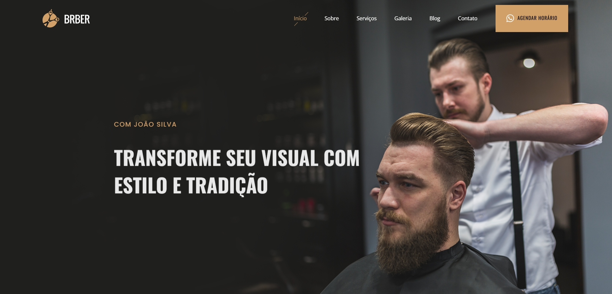

# 💈 Barbearia Corte Fino - Estilo e Tradição  

Site institucional desenvolvido para apresentar **os serviços, diferenciais e contato** da **Barbearia Corte Fino**, localizada em Goiânia.  
O projeto foi construído com **HTML5**, **CSS3** e **Bootstrap**, utilizando bibliotecas modernas para garantir **animações suaves, carrosséis interativos e uma experiência de usuário de alto nível**.

## 🌐 Demonstração  

  
🔗 **Acesse o site:** [https://victormelkor.github.io/barbearia](https://victormelkor.github.io/barbearia)  

---

## 🚀 Tecnologias Utilizadas  

  
  
  
  

- **AOS (Animate On Scroll)** – animações ao rolar a página  
- **Swiper.js** – carrosséis responsivos  
- **Glightbox** – exibição de imagens em modal  
- **Waypoints** – disparo de efeitos em seções específicas  
- **PureCounter** – contadores animados para destaques  
- **Isotope Layout** – organização dinâmica de elementos  
- **ImagesLoaded** – carregamento otimizado de imagens  

---

## 🎯 Funcionalidades  

- Página inicial apresentando a barbearia  
- Seções de **serviços**, **galeria de estilos**, **blog** e **contato**  
- **Agendamento online** para clientes  
- Mapa integrado com localização  
- Animações e efeitos para uma UX envolvente  
- Layout 100% responsivo  

---

## 📄 Licença  

Este projeto está sob a licença MIT. Consulte o arquivo [LICENSE](./LICENSE) para mais detalhes.  

---

## 🧑‍💻 Autor

  
  
  
  
  
  
